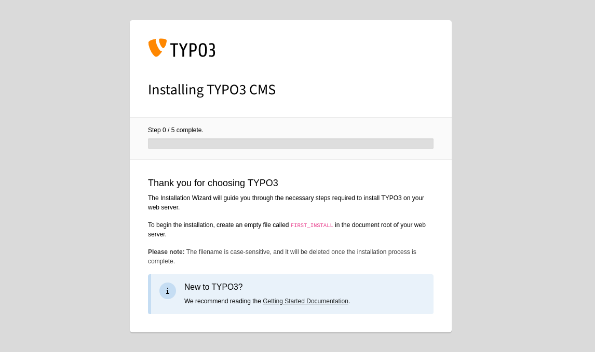
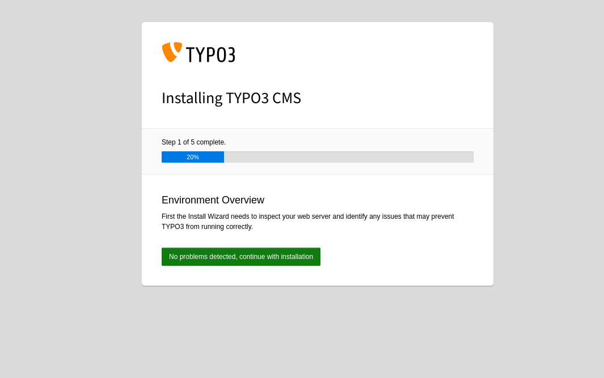
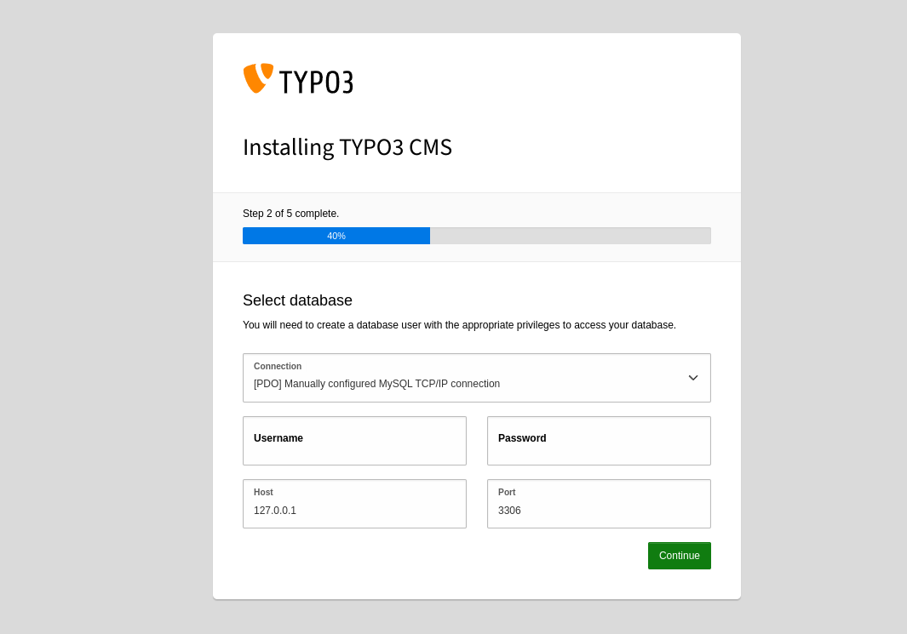
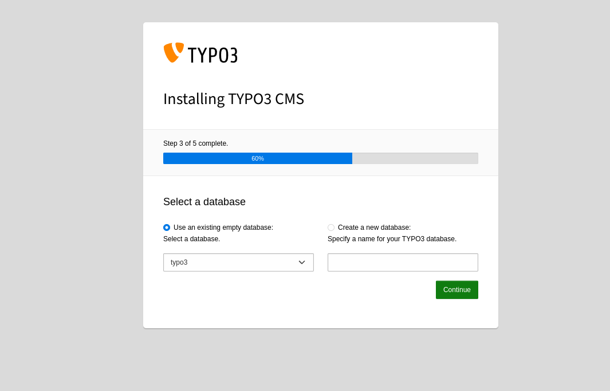
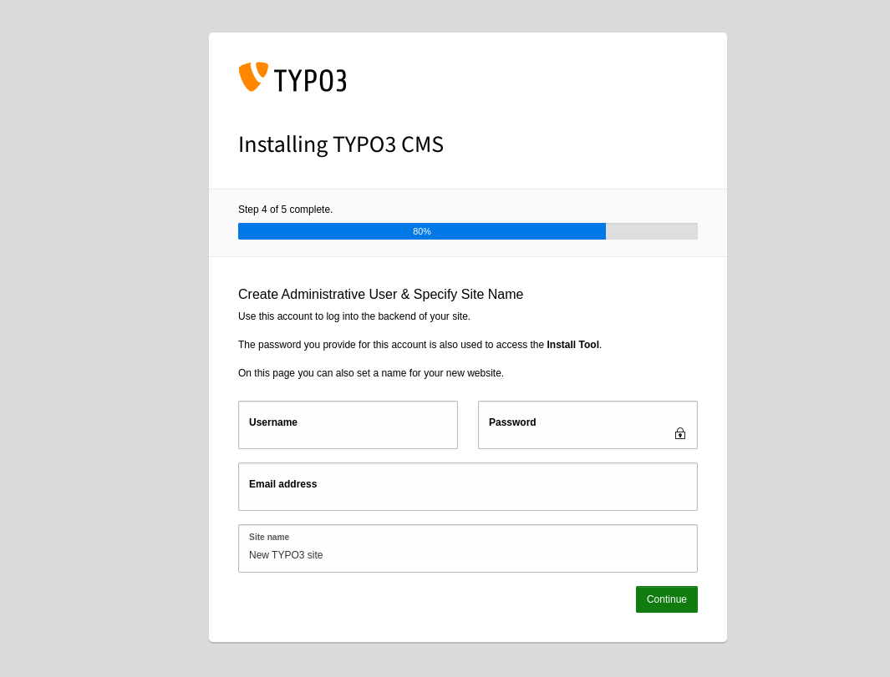
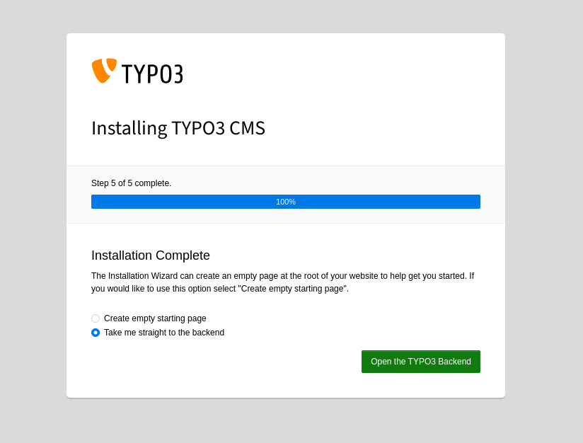

# Docker-Based TYPO3 Development Environment Setup

## Overview
This project was built to serve as a TYPO3 development and deployment environment, based on the
[TYPO3 System Requirements](https://docs.typo3.org/m/typo3/tutorial-getting-started/main/en-us/SystemRequirements/Index.html).

## Project Tree
    ├── docker
    │   ├── httpd
    │   │   ├── conf
    │   │   │   ├── mywebsite_vhost.conf
    │   │   │   ├── typo3.ini
    │   │   │   └── xdebug.ini
    │   │   ├── Dockerfile
    │   │   └── env
    │   │       ├── extra.env
    │   │       ├── extra.env.template
    │   │       └── httpd.env
    │   └── mysql
    │       └── Dockerfile
    ├── src
    ├── docker-compose.dev.yaml
    ├── docker-compose.yaml
    ├── LICENSE
    └── README.md

## Prerequisites

Before setting up the project, ensure you have Docker and docker-compose installed on your machine. Follow the instructions below to install them:

- For Docker, visit [Docker Installation Guide](https://docs.docker.com/engine/install/).
- For docker-compose, visit [docker-compose Installation Guide](https://docs.docker.com/compose/install/).

## Installation

Follow these steps to set up the project on your local machine:

1. **Create the Project Folder**:  
    ```bash
    mkdir typo3-project
    ```

2. **Clone the Project**:  
    ```bash
    git clone -b typo3 --single-branch https://github.com/dev-Toumeh/php-dockerCompose-devstack.git
    ```

3. **Run the Project in Development Mode**:  
    ```bash
    docker-compose -f docker-compose.dev.yaml up -d
    ```

4. **Run the Project in Deployment Mode**:  
    ```bash
    docker-compose -f docker-compose.dev.yaml exec -it db /bin/bash
    ```

5. **install typo3** 
   - with debug function
     ```bash
     docker-compose -f docker-compose.dev.yaml exec -it typo3 /bin/bash
     ```
   - without debugging function
     ```bash
     docker-compose exec -it typo3 /bin/bash
     ```
   - (optional) if you want to run the Container as root, add "-u 0" after "-it"
   - install Typo3 using composer
     ```bash
     composer create-project "typo3/cms-base-distribution:^12.4" ./
     ```
     

## Configuration

### Adding the Hostname on Your Local Machine
#### Optional
— You can change the default hostname "mywebsite.local"
by going to `./docker/httpd/env/httpd.env` and adjust the `SERVER_NAME` variable 
#### On Windows:
1. **Open Notepad as Administrator**:
    - Search for Notepad in the Start menu, right-click on it, and select "Run as administrator."
2. **Open the Hosts File**:
    - In Notepad, navigate to `File` > `Open`, go to `C:\Windows\System32\drivers\etc`, and open the `hosts` file. If the file doesn't appear, select to show All Files (*.*) from the dropdown menu.
3. **Add the Mapping**:
    - At the end of the file, add the following line: `172.0.0.1 mywebsite.local`
4. **Save and Close**:
    - Save the changes by clicking `File` > `Save` and then close Notepad.

#### On Linux:
1. **Open a Terminal**.
2. **Edit the Hosts File**:
    - Type `sudo nano /etc/hosts` and press Enter. You might be asked for your password.
3. **Add the Mapping**:
    - At the end of the file, add the line: `172.0.0.1 mywebsite.local`
4. **Save and Exit**:
    - Press `Ctrl+O` to save the file, then `Ctrl+X` to exit nano.


### Open the Desired host name by default http://mywebsite.local


The project will be placed in the src folder by default,
create file called `FIRST_INSTALL` in `.src/public` after that reload the page and will get the following Page

Click continue and add the following 
Connection: PDO Manual TCP/IP
Username: root
password: 1234
Host: db // docker-compose service name
Port: 3306

No, you need to add the database.
By default, the container includes a database called TYPO3.
You can choose it; otherwise, you create your own.

Now create your login data

After that you will be good to go


## Apache HTTPD Configuration
#### Adjust the Apache variables in `docker/httpd/env/httpd.env`
```dotenv
SERVER_NAME=mywebsite.local
APACHE_DOCUMENT_ROOT=/var/www/html/public
APACHE_RUN_USER=my-user
APACHE_RUN_GROUP=my-user
XDEBUG_MODE=debug
```
#### If you have extra variables you can add them in `docker/httpd/env/httpd.env`
  - delete `template` from extra.env.template
  - uncomment line 22 in docker-compose.yaml file

#### You can manage the virtual host configuration by opining the following directory `docker/httpd/conf/mywebsite_vhost.conf` the following config is activated by default

```apache 
<VirtualHost *:80>
ServerName ${SERVER_NAME}
DocumentRoot ${APACHE_DOCUMENT_ROOT}

<Directory ${APACHE_DOCUMENT_ROOT}>
Options Indexes FollowSymLinks
AllowOverride All
Require all granted
</Directory>
</VirtualHost>
```

if you are planning to use the stack for deployment uncomment, the second part

```apache
<VirtualHost *:80>
    ServerName ${SERVER_NAME}
    ServerAlias ${SERVER_ALIAS}
    Redirect permanent / https://${SERVER_NAME}/
</VirtualHost>


<VirtualHost *:443>
    ServerName ${SERVER_NAME}
    ServerAlias ${SERVER_ALIAS}

    DocumentRoot ${APACHE_DOCUMENT_ROOT}

    SSLEngine on
    SSLCertificateFile ${SSL_CERT_FILE}
    SSLCertificateKeyFile ${SSL_CERT_KEY_FILE}

    # Redirect non-www to www if accessed directly by SERVER_ALIAS
    RewriteEngine On
    RewriteCond %{SERVER_NAME} =${SERVER_ALIAS}
    RewriteRule ^ https://${SERVER_NAME}%{REQUEST_URI} [L,R=301,NE]

<Directory ${APACHE_DOCUMENT_ROOT}>
        Options Indexes FollowSymLinks
        AllowOverride All
        Require all granted
</Directory>
</VirtualHost>
```

## MySQL Configuration
- you can edit the database root password inside .env
```dotenv
#Database variables
MARIADB_ROOT_PASSWORD=1234
MARIADB_DATABASE=typo3
```
